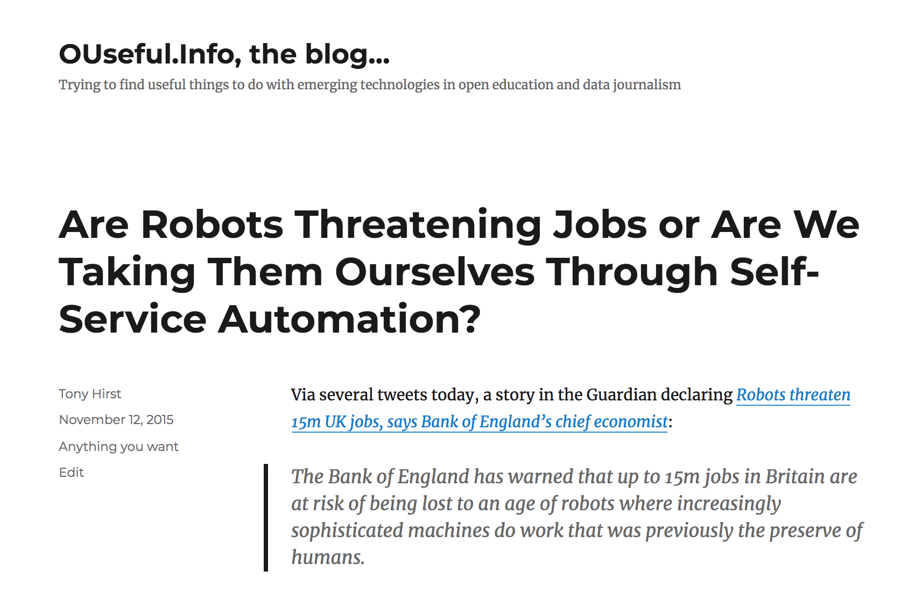
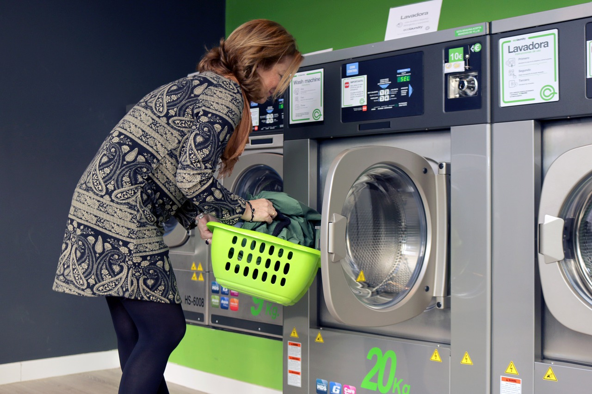
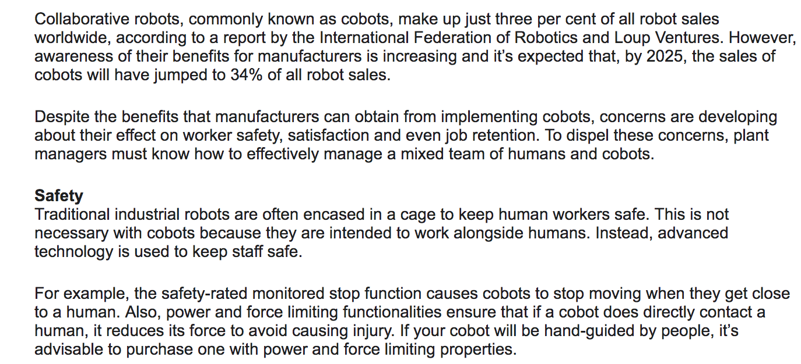
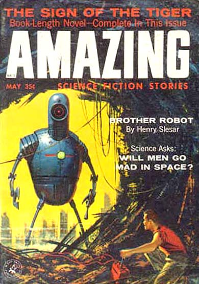
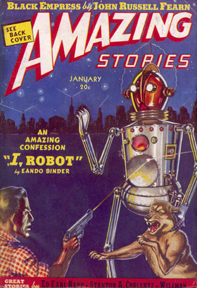

---
jupyter:
  jupytext:
    text_representation:
      extension: .md
      format_name: markdown
      format_version: '1.1'
      jupytext_version: 1.2.1
  kernelspec:
    display_name: Python 3
    language: python
    name: python3
---

<!-- #region {"slideshow": {"slide_type": "slide"}, "hideCode": true, "hidePrompt": true} -->
# Whose Job is It Anyway?


## Humans <s>vs.</s> *and?* Robots *(Work in Progress)*

Tony Hirst

OU Residental School, T176,  2019
<!-- #endregion -->

<!-- #region {"slideshow": {"slide_type": "slide"}, "hideCode": true, "hidePrompt": true} -->
# Background...

*I happened to be at the Ventnor Fringe festival last week...*
<!-- #endregion -->

<!-- #region {"slideshow": {"slide_type": "slide"}, "hideCode": true, "hidePrompt": true} -->
# From the Archive....


<!-- #endregion -->

<!-- #region {"slideshow": {"slide_type": "slide"}, "hideCode": true, "hidePrompt": true} -->
# There Contibues To Be A Lot of Talk...


<!-- #endregion -->

<!-- #region {"slideshow": {"slide_type": "slide"}, "hideCode": true, "hidePrompt": true} -->
# But Hasn't It Ever Been Thus?


<!-- #endregion -->

<!-- #region {"slideshow": {"slide_type": "slide"}, "hideCode": true, "hidePrompt": true} -->
# Enabled...


<!-- #endregion -->

<!-- #region {"slideshow": {"slide_type": "slide"}, "hideCode": true, "hidePrompt": true} -->
# Have You Ever...
<!-- #endregion -->

<!-- #region {"slideshow": {"slide_type": "subslide"}, "hideCode": true, "hidePrompt": true} -->
- used a self-service checkout in a supermarket rather than waiting in line for a cashier to scan your basketload of goods, let alone bought a bag of crisps or bottle of water from a (self-service) vending machine?
<!-- #endregion -->

<!-- #region {"slideshow": {"slide_type": "subslide"}, "hideCode": true, "hidePrompt": true} -->
- used a self-service banking express machine or kiosk to pay in a cheque, let alone used an ATM to take cash out?
<!-- #endregion -->

<!-- #region {"slideshow": {"slide_type": "subslide"}, "hideCode": true, "hidePrompt": true} -->
- used a self-service library kiosk to scan out a library book?
<!-- #endregion -->

<!-- #region {"slideshow": {"slide_type": "subslide"}, "hideCode": true, "hidePrompt": true} -->
- used a self-service check-in kiosk or self-service luggage drop off in an airport?
<!-- #endregion -->

<!-- #region {"slideshow": {"slide_type": "subslide"}, "hideCode": true, "hidePrompt": true} -->
- used a self-service ticket machine to buy a train ticket?
<!-- #endregion -->

<!-- #region {"slideshow": {"slide_type": "subslide"}, "hideCode": true, "hidePrompt": true} -->
- collected goods from a (self-service) Amazon locker?
<!-- #endregion -->

<!-- #region {"slideshow": {"slide_type": "slide"}, "hideCode": true, "hidePrompt": true} -->
# So Who Works for Whom, & Whose Jobs Are They Now Anyway?


<!-- #endregion -->

<!-- #region {"slideshow": {"slide_type": "slide"}, "hideCode": true, "hidePrompt": true} -->
# We Feed the Machine in Other Ways, Too...


<!-- #endregion -->

<!-- #region {"slideshow": {"slide_type": "slide"}, "hideCode": true, "hidePrompt": true} -->
# How Did We Get To Where We (Already) Are Today?

*Is there a story in there somewhere? Can we predict what might happen next?*

<!-- #endregion -->

<!-- #region {"slideshow": {"slide_type": "slide"}, "hideCode": true, "hidePrompt": true} -->
# In the Beginning — Robot Bartenders
<!-- #endregion -->

```python hideCode=true slideshow={"slide_type": "-"} hidePrompt=true
from IPython.lib.display import YouTubeVideo
YouTubeVideo('https://www.youtube.com/watch?v=OxrzRJ-UHyI&list=PL6qLpyDDZDMTLtFq1ZsBHtOnY-6pCi7F5&t=0s',width=800,height=500)
```

<!-- #region {"slideshow": {"slide_type": "slide"}, "hideCode": true, "hidePrompt": true} -->
# HOW ROBOTS REPLACE HUMANS, STEP 1?

Replace the human with a robot, literally...
<!-- #endregion -->

<!-- #region {"slideshow": {"slide_type": "slide"}, "hideCode": true, "hidePrompt": true} -->
# Why Bother 1?
<!-- #endregion -->

<!-- #region {"slideshow": {"slide_type": "fragment"}, "hideCode": true, "hidePrompt": true} -->
- make our lives better
  - dull (repetitive task)
  - dirty (unpleasant environment)
  - dangerous (unsafe environment / task)
<!-- #endregion -->

<!-- #region {"slideshow": {"slide_type": "slide"}, "hideCode": true, "hidePrompt": true} -->
# Why Bother 2?
<!-- #endregion -->

<!-- #region {"slideshow": {"slide_type": "fragment"}, "hideCode": true, "hidePrompt": true} -->
- the promise of automation
  - it scales
  - human labour is expensive
<!-- #endregion -->

<!-- #region {"slideshow": {"slide_type": "slide"}, "hideCode": true, "hidePrompt": true} -->
# Why Bother 3?
<!-- #endregion -->

<!-- #region {"slideshow": {"slide_type": "fragment"}, "hideCode": true, "hidePrompt": true} -->
- process re-engineering
  - disintermediation
  - reintermediation
<!-- #endregion -->

<!-- #region {"slideshow": {"slide_type": "slide"}, "hideCode": true, "hidePrompt": true} -->
# (Re)Intermediate and Replace?

.jpg)
<!-- #endregion -->

<!-- #region {"slideshow": {"slide_type": "slide"}, "hideCode": true, "hidePrompt": true} -->
# Milton Keynes....


<!-- #endregion -->

```python slideshow={"slide_type": "subslide"} hideCode=true hidePrompt=true
YouTubeVideo('https://www.youtube.com/watch?v=OxrzRJ-UHyI&list=PL6qLpyDDZDMTLtFq1ZsBHtOnY-6pCi7F5&t=0&index=4',width=800,height=500)

```

<!-- #region {"slideshow": {"slide_type": "slide"}, "hideCode": true, "hidePrompt": true} -->
# Is It Legal?

And who says?

And if it's *not* legal now, when might it be?
<!-- #endregion -->

<!-- #region {"slideshow": {"slide_type": "slide"}, "hideCode": true, "hidePrompt": true} -->
# Local Regulations


<!-- #endregion -->

<!-- #region {"slideshow": {"slide_type": "slide"}, "hideCode": true, "hidePrompt": true} -->
# Who's In Control?


<!-- #endregion -->

<!-- #region {"slideshow": {"slide_type": "slide"}, "hideCode": true, "hidePrompt": true} -->
# Artificially Intelligent?


<!-- #endregion -->

<!-- #region {"slideshow": {"slide_type": "slide"}, "hideCode": true, "hidePrompt": true} -->
# Human in the Loop


<!-- #endregion -->

<!-- #region {"slideshow": {"slide_type": "slide"}, "hideCode": true, "hidePrompt": true} -->
# The Law of the Land...
<!-- #endregion -->

```python slideshow={"slide_type": "-"} hideCode=true hidePrompt=true
from IPython.display import IFrame

IFrame("http://www.legislation.gov.uk/ukpga/2018/18/contents/enacted", width=1000, height=380)
```

<!-- #region {"slideshow": {"slide_type": "slide"}, "hideCode": true, "hidePrompt": true} -->
# Where Might Parliament Go Next?
<!-- #endregion -->

```python slideshow={"slide_type": "-"} hideCode=true hidePrompt=true
IFrame("https://beta.parliament.uk/search?q=robotics", width=1000, height=380)
```

<!-- #region {"slideshow": {"slide_type": "slide"}, "hideCode": true, "hidePrompt": true} -->
# HOW ROBOTS REPLACE HUMANS, STEP 2?

Drop the pretence...

Change the human environment to a robot environment...
<!-- #endregion -->

<!-- #region {"slideshow": {"slide_type": "slide"}, "hideCode": true, "hidePrompt": true} -->
# Whose Environment Is It Anyway?


<!-- #endregion -->

<!-- #region {"slideshow": {"slide_type": "slide"}, "hideCode": true, "hidePrompt": true} -->
# Mechanising (Industrialising?) the Bartender
<!-- #endregion -->

```python slideshow={"slide_type": "-"} hideCode=true hidePrompt=true
YouTubeVideo('https://www.youtube.com/watch?v=OxrzRJ-UHyI&list=PL6qLpyDDZDMTLtFq1ZsBHtOnY-6pCi7F5&index=1&t=0s',width=800,height=500)

```

<!-- #region {"hideCode": true, "hidePrompt": true, "slideshow": {"slide_type": "slide"}} -->
# CoBots - Working *With* Robots, Or Teaching Them To Replace Us?
<!-- #endregion -->

```python hideCode=true hidePrompt=true slideshow={"slide_type": "-"}
YouTubeVideo('https://www.youtube.com/watch?v=OxrzRJ-UHyI&list=PL6qLpyDDZDMTLtFq1ZsBHtOnY-6pCi7F5&t=0&index=7',width=800,height=500)
```

<!-- #region {"slideshow": {"slide_type": "slide"}, "hideCode": true, "hidePrompt": true} -->
# How Big A Market?!

## UK Construction Online: "Are you cobot ready?" 5 Nov 18

<!-- #endregion -->

<!-- #region {"slideshow": {"slide_type": "slide"}, "hideCode": true, "hidePrompt": true} -->
# Acceptable Standards...
<!-- #endregion -->

```python hideCode=true hidePrompt=true
IFrame("https://www.iso.org/standard/62996.html", width=1000, height=380)
```

<!-- #region {"slideshow": {"slide_type": "slide"}, "hideCode": true, "hidePrompt": true} -->
# Hostile (Defensive) Architecture

In the short term, the built environment is still a human environment, albeit dehumanised in certain respects...


<!-- #endregion -->

<!-- #region {"slideshow": {"slide_type": "slide"}, "hideCode": true, "hidePrompt": true} -->
# (Robot) Accessible Environments


<!-- #endregion -->

<!-- #region {"slideshow": {"slide_type": "slide"}, "hideCode": true, "hidePrompt": true} -->
# Call Me Cynical...


<!-- #endregion -->

<!-- #region {"slideshow": {"slide_type": "slide"}, "hideCode": true, "hidePrompt": true} -->
# Designing *for Robots* — Change the Work Environment...
<!-- #endregion -->

```python hideCode=true hidePrompt=true
YouTubeVideo('https://www.youtube.com/watch?v=OxrzRJ-UHyI&list=PL6qLpyDDZDMTLtFq1ZsBHtOnY-6pCi7F5&t=0&index=6',width=800,height=500)
```

<!-- #region {"hideCode": true, "hidePrompt": true, "slideshow": {"slide_type": "slide"}} -->
# Designing *for Robots* — Change the Public / Built Environment...
<!-- #endregion -->

```python hideCode=true hidePrompt=true
YouTubeVideo('https://www.youtube.com/watch?v=OxrzRJ-UHyI&list=PL6qLpyDDZDMTLtFq1ZsBHtOnY-6pCi7F5&t=0&index=5',width=800,height=500)
```

<!-- #region {"slideshow": {"slide_type": "slide"}, "hideCode": true, "hidePrompt": true} -->
# INTERLUDE


Promise of the future...



<!-- #endregion -->

<!-- #region {"slideshow": {"slide_type": "slide"}, "hideCode": true, "hidePrompt": true} -->
# Hype or Reality? Kickstarting the Future?
<!-- #endregion -->

```python hideCode=true hidePrompt=true
YouTubeVideo('https://www.youtube.com/watch?v=OxrzRJ-UHyI&list=PL6qLpyDDZDMTLtFq1ZsBHtOnY-6pCi7F5&t=0s&index=2',width=800,height=500)
```

<!-- #region {"slideshow": {"slide_type": "slide"}, "hideCode": true, "hidePrompt": true} -->
# Let's Just Make an App for That...

...with a shiny UI...

...and worry about the implementation later...
<!-- #endregion -->

<!-- #region {"slideshow": {"slide_type": "slide"}, "hideCode": true, "hidePrompt": true} -->
# HOW ROBOTS REPLACE HUMANS, STEP 3?


By not thinking it through...

...and then seeing opportunity in the externalities...
<!-- #endregion -->

<!-- #region {"slideshow": {"slide_type": "slide"}, "hideCode": true, "hidePrompt": true} -->
# One Step, Then Another...

.jpg)
<!-- #endregion -->

<!-- #region {"slideshow": {"slide_type": "slide"}, "hideCode": true, "hidePrompt": true} -->
# Changing the Other Side of the Transaction?
<!-- #endregion -->

<!-- #region {"slideshow": {"slide_type": "fragment"}, "hideCode": true, "hidePrompt": true} -->

<!-- #endregion -->

<!-- #region {"slideshow": {"slide_type": "slide"}, "hideCode": true, "hidePrompt": true} -->
# HOW ROBOTS REPLACE HUMANS, STEP 4?

So commonplace you barely notice them...

*(Have you ever....?)*
<!-- #endregion -->

<!-- #region {"slideshow": {"slide_type": "subslide"}, "hideCode": true, "hidePrompt": true} -->
## Boring is as Boring Does...
<!-- #endregion -->

<!-- #region {"slideshow": {"slide_type": "fragment"}, "hideCode": true, "hidePrompt": true} -->
"AI" - *Almost Invented*
<!-- #endregion -->

<!-- #region {"slideshow": {"slide_type": "fragment"}, "hideCode": true, "hidePrompt": true} -->
"Robot" - *machine that does a human task we haven't see a machine do before*
<!-- #endregion -->

<!-- #region {"slideshow": {"slide_type": "slide"}, "hideCode": true, "hidePrompt": true} -->
# Just Another <s>Coffee</s> Bar Machine?
<!-- #endregion -->

```python hideCode=true hidePrompt=true slideshow={"slide_type": "fragment"}
YouTubeVideo('https://www.youtube.com/watch?v=OxrzRJ-UHyI&list=PL6qLpyDDZDMTLtFq1ZsBHtOnY-6pCi7F5&t=0&index=3',width=800,height=500)

```

<!-- #region {"slideshow": {"slide_type": "slide"}, "hideCode": true, "hidePrompt": true} -->
# Robots End Up Being Just Another Machine...


<!-- #endregion -->

<!-- #region {"slideshow": {"slide_type": "slide"}, "hideCode": true, "hidePrompt": true} -->
# *to be continued..?*
<!-- #endregion -->
