---
jupyter:
  jupytext:
    formats: ipynb,md
    text_representation:
      extension: .md
      format_name: markdown
      format_version: '1.2'
      jupytext_version: 1.3.0rc0+dev
  kernelspec:
    display_name: Python 3
    language: python
    name: python3
---

<!-- #region slideshow={"slide_type": "slide"} -->
# Deriving Interactive, Read/Write Course Materials From OU-XML
 
### Tony Hirst

#### Computing & Communications

*tony.hirst @ open.ac.uk*

__github.com/innovationOUtside__
<span style='float:right'>__blog.ouseful.info__</span>
<!-- #endregion -->

<!-- #region slideshow={"slide_type": "notes"} -->
*As part of the OU’s publishing workflow, course materials are mastered into an XML document format from which online materials, ebooks, PDF and print versions can be generated.*
 
*But as this presentation will show, we can take OU-XML further, publishing to document formats that can more directly support direct interactive authoring, as well as student customisable read/writeable notebooks, using off-the-shelf third party tools and just a tiny bit of code...*
<!-- #endregion -->

<!-- #region slideshow={"slide_type": "slide"} -->
# A Long Time Ago...
<!-- #endregion -->

<!-- #region slideshow={"slide_type": "slide"} -->
# Mindmaps - TM129

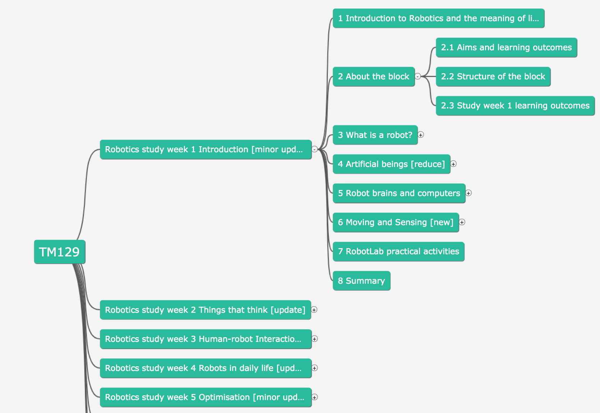
<!-- #endregion -->

<!-- #region slideshow={"slide_type": "slide"} -->
# Macroscoping VLE Materials

<div>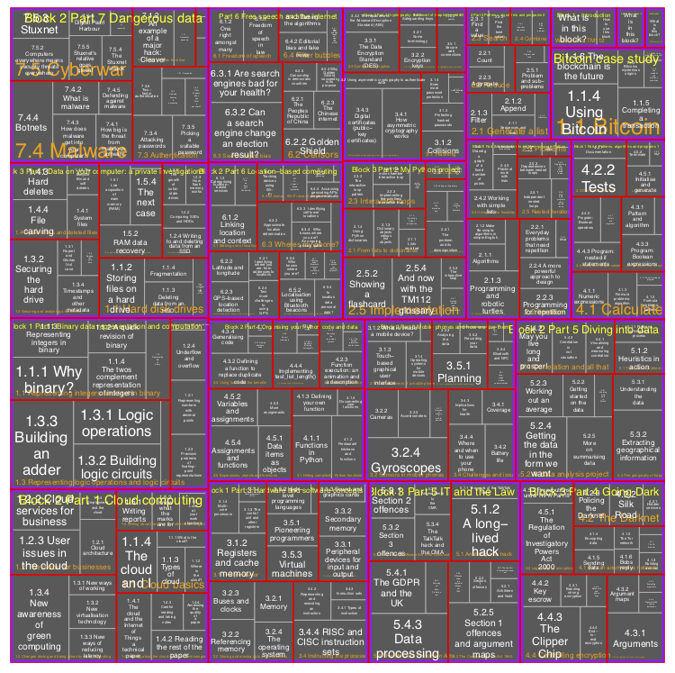
    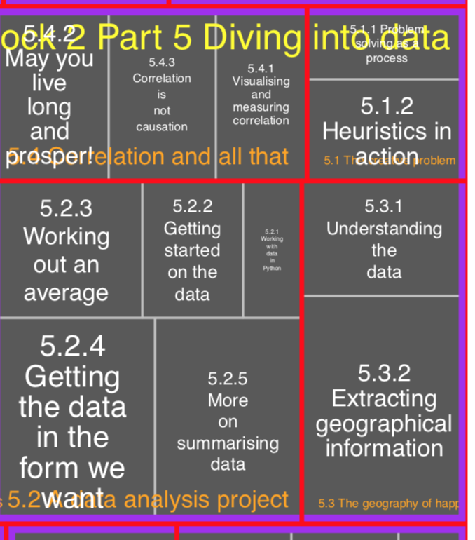<div>
<!-- #endregion -->

<!-- #region slideshow={"slide_type": "slide"} hide_input=false -->
## Interactive Treemap


[plotly treemap](presentation_figures/module_test.html)
<!-- #endregion -->

<!-- #region slideshow={"slide_type": "slide"} -->
# Netwulf

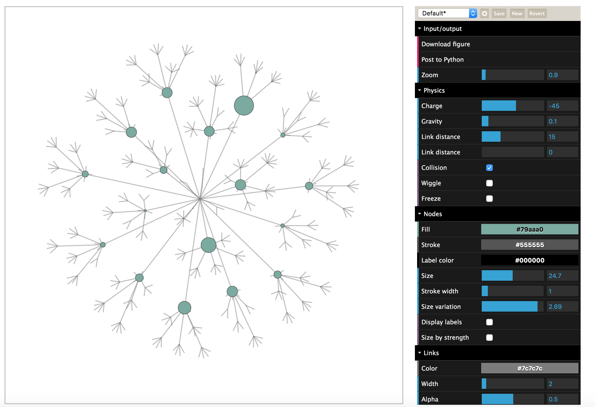

<!-- #endregion -->

<!-- #region slideshow={"slide_type": "slide"} -->
# From OU-XML...

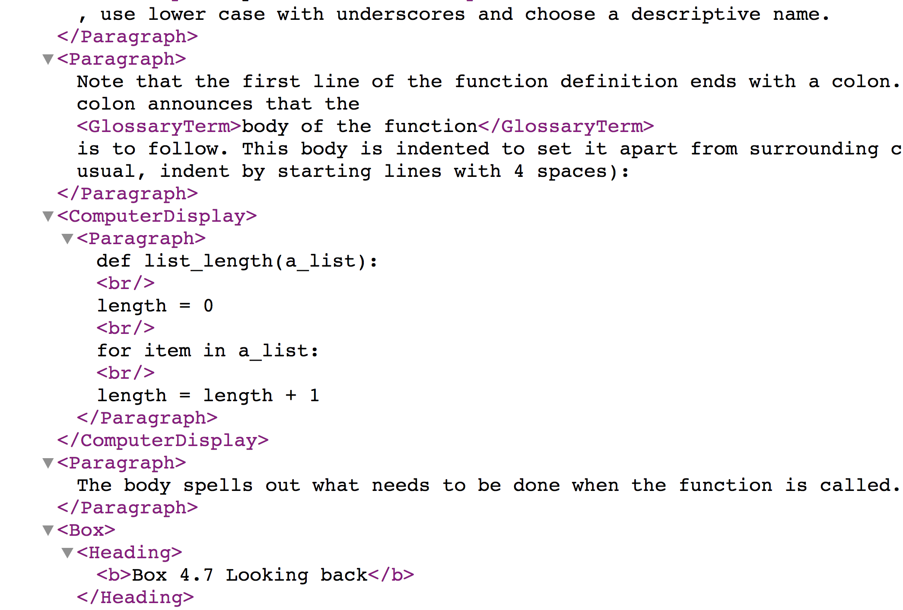
<!-- #endregion -->

<!-- #region slideshow={"slide_type": "slide"} -->
# ...to Markdown...
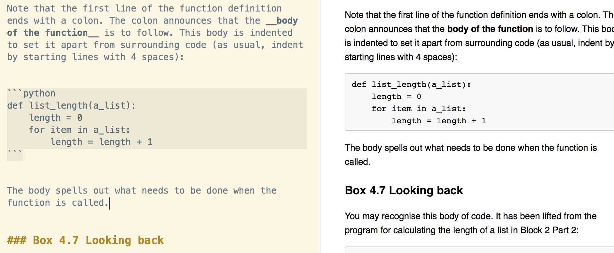
<!-- #endregion -->

<!-- #region slideshow={"slide_type": "slide"} -->
# Going Back to the Future
The web was intended as a read-write medium.
<!-- #endregion -->

<!-- #region slideshow={"slide_type": "slide"} -->
# Jupytext

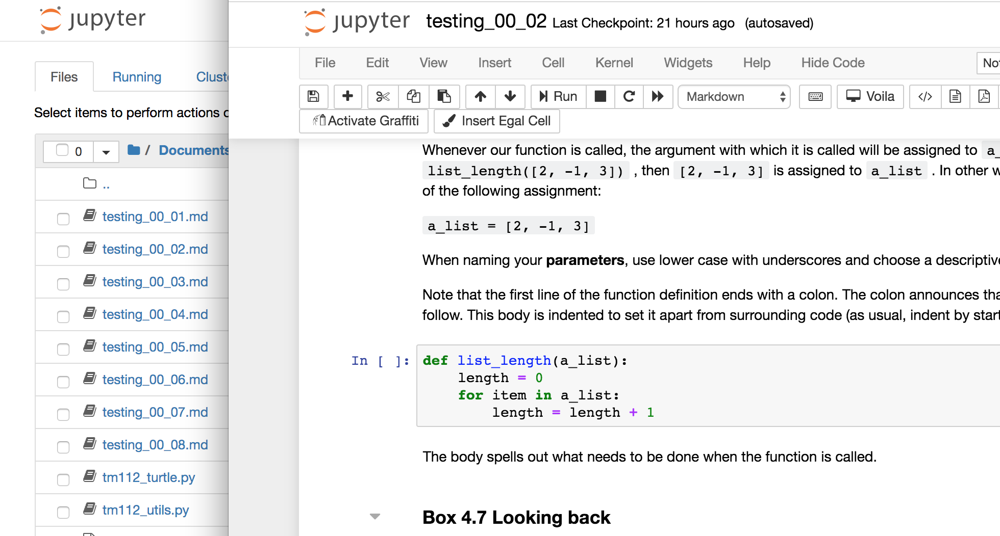
<!-- #endregion -->

<!-- #region slideshow={"slide_type": "slide"} -->
# Jupytext

Provides a set of tools for:

- editing text formats in a notebook environment;
- converting between  text formats and `.ipynb` JSON notebook format;
- pairing documents (for example, `.md` and `.ipynb`.

<!-- #endregion -->

<!-- #region slideshow={"slide_type": "slide"} -->
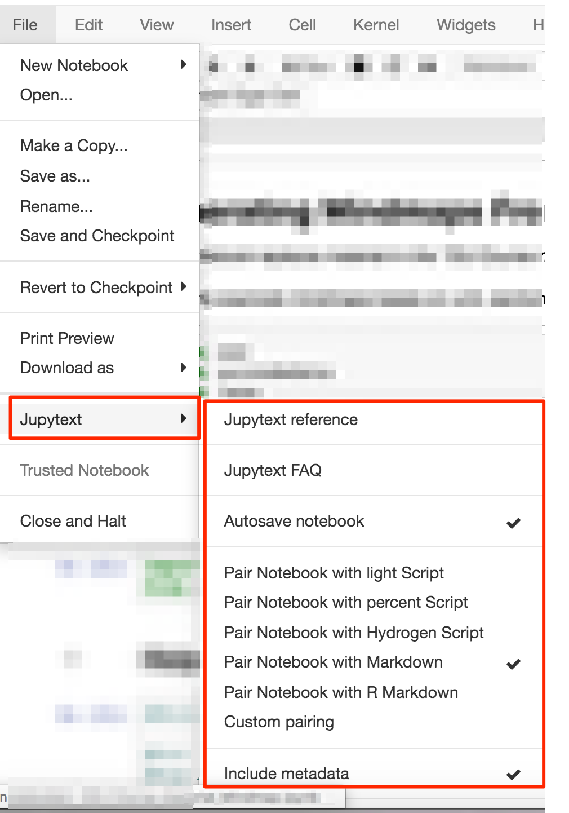
<!-- #endregion -->

<!-- #region slideshow={"slide_type": "slide"} -->
# Jupytext Markdown

"Extends" markdown documents to accept metadata fields that meaningful in the jupyter `.ipynb` document format.

This supports round-tripping between documents types.
<!-- #endregion -->

<!-- #region slideshow={"slide_type": "slide"} -->
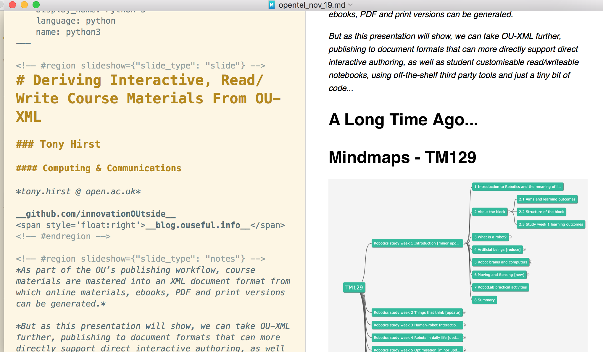
<!-- #endregion -->

<!-- #region slideshow={"slide_type": "slide"} -->
# Reimagining Activities for the Read-Write Web

- *work in progress*: elements of TM112 (private repo access on request);
- *coming soon*: various OpenLearn examples (public repo access).
<!-- #endregion -->

<!-- #region slideshow={"slide_type": "slide"} -->
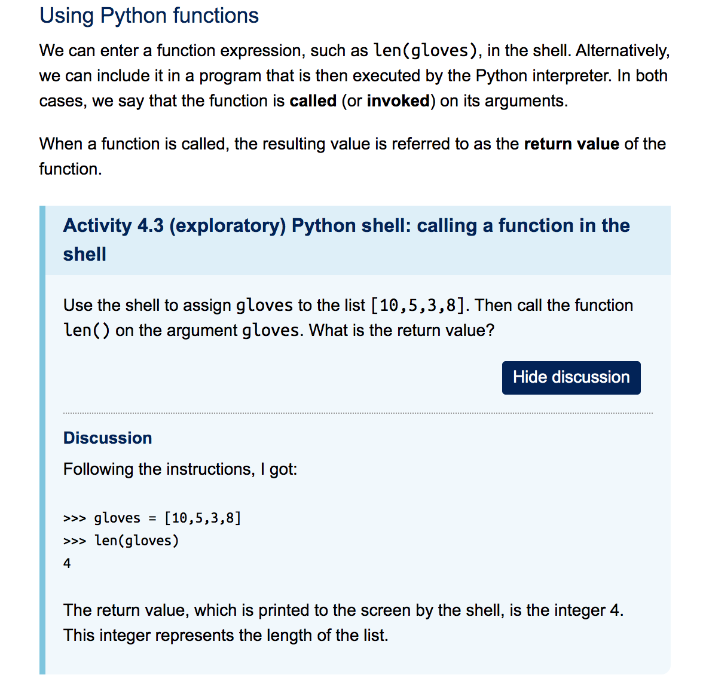
<!-- #endregion -->

<!-- #region slideshow={"slide_type": "slide"} -->
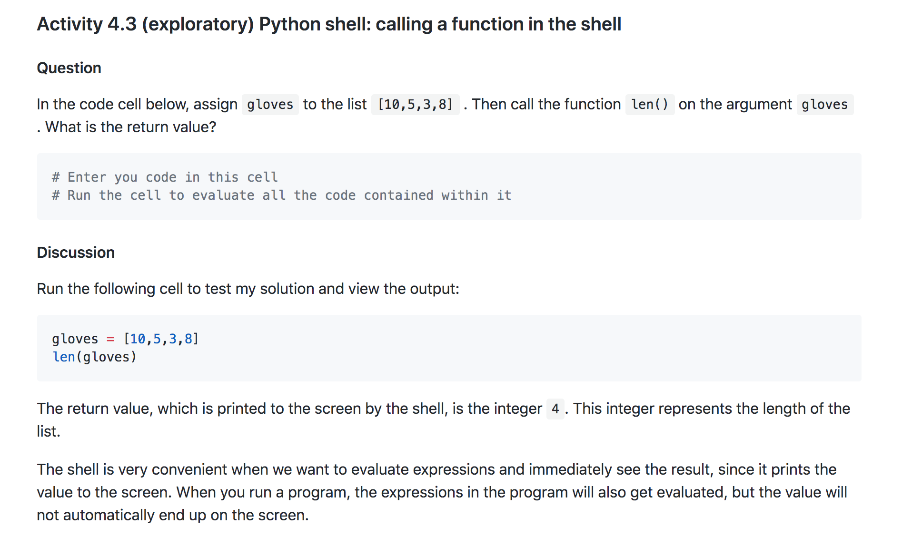
<!-- #endregion -->

<!-- #region slideshow={"slide_type": "slide"} -->
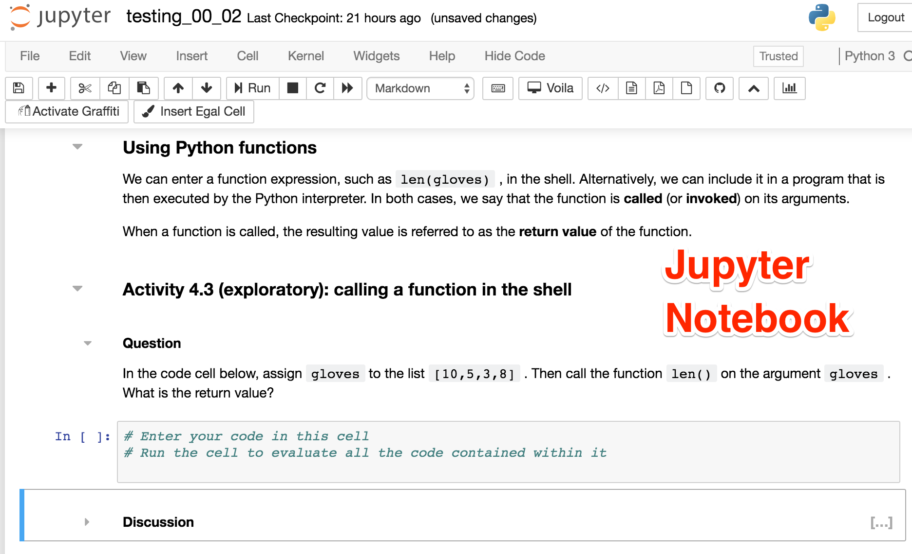
<!-- #endregion -->

<!-- #region slideshow={"slide_type": "slide"} -->
# Alternative Authoring Environments


- markdown:
    - text editor;
    - markdown editor;
    - JupyterLab (right click on `.md` file in file listing);
- `.ipynb` notebook format
  - Jupyter notebooks
  - Netflix Polynote
<!-- #endregion -->

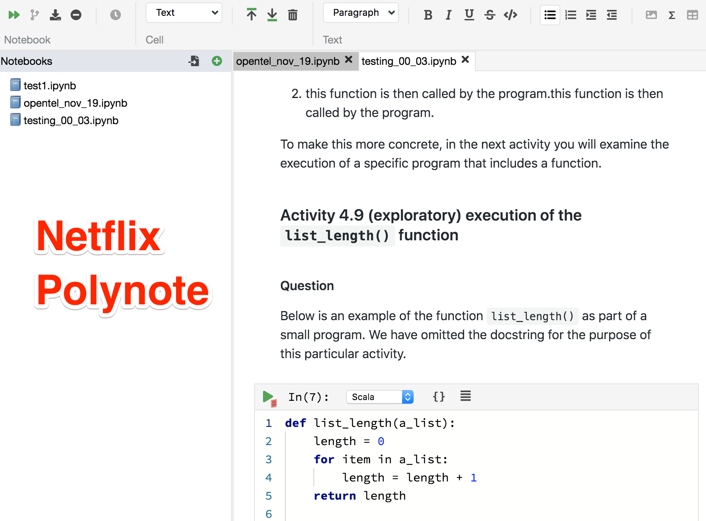

<!-- #region slideshow={"slide_type": "slide"} -->
# The Medium Makes Things Possible...

...and encourages particular sorts of activity...

...for authors as well as students...
<!-- #endregion -->

<!-- #region slideshow={"slide_type": "slide"} -->
<div>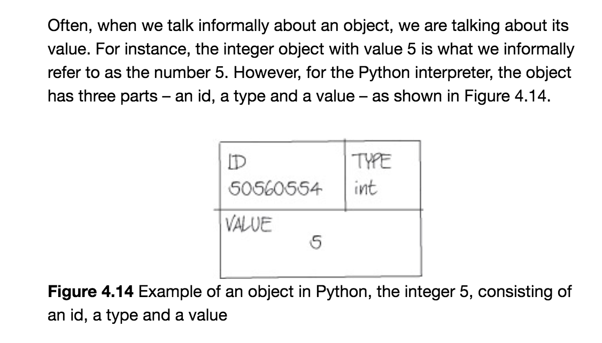
    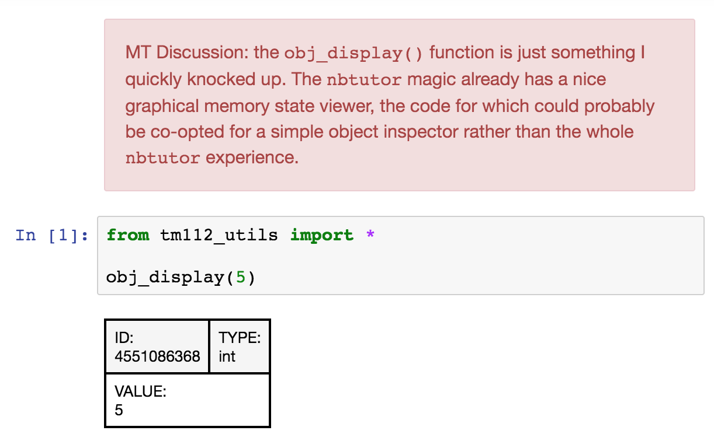<div>
<!-- #endregion -->

<!-- #region slideshow={"slide_type": "slide"} -->
# For Real...(1)
<!-- #endregion -->

```python
from presentation_figures.tm112_utils import *

obj_display(7)
obj_display("hello world")
obj_display([5,3,7])
```

<!-- #region slideshow={"slide_type": "slide"} -->
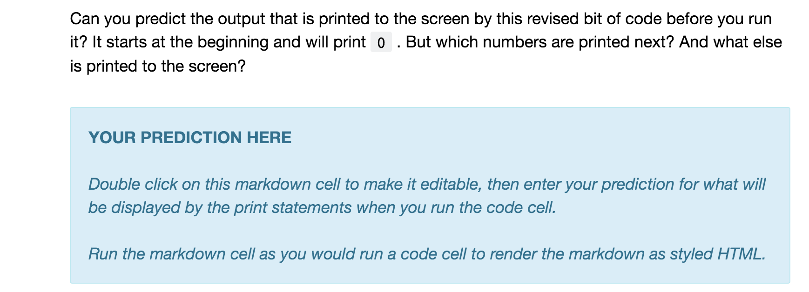
<!-- #endregion -->

<!-- #region slideshow={"slide_type": "slide"} -->
# For Real...(2)

Can you predict the output that is printed to the screen by this revised bit of code before you run it? It starts at the beginning and will print  `0` . But which numbers are printed next? And what else is printed to the screen?
<!-- #endregion -->

<!-- #region slideshow={"slide_type": "-"} -->
<div class='alert alert-info'><strong>YOUR PREDICTION HERE</strong><br/>
<br/>
    <em>Double click on this markdown cell to make it editable, then enter your prediction for what will be displayed by the print statements when you run the code cell.</em><br/>
<br/>
    <em>Run the markdown cell as you would run a code cell to render the markdown as styled HTML.</em></div>
<!-- #endregion -->

<!-- #region slideshow={"slide_type": "skip"} -->
<div class='alert alert-info'><strong>YOUR PREDICTION HERE</strong><br/>
<br/>
    <em>Double click on this markdown cell to make it editable, then enter your prediction for what will be displayed by the print statements when you run the code cell.</em><br/>
<br/>
    <em>Run the markdown cell as you would run a code cell to render the markdown as styled HTML.</em></div>
<!-- #endregion -->

<!-- #region slideshow={"slide_type": "slide"} -->
# Github

- file sharing;
- version control (branches);
- comment and review;
- "blame";
- change analysis.
<!-- #endregion -->

<!-- #region slideshow={"slide_type": "slide"} -->
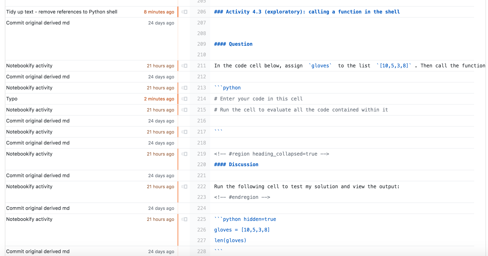
<!-- #endregion -->

<!-- #region slideshow={"slide_type": "slide"} -->
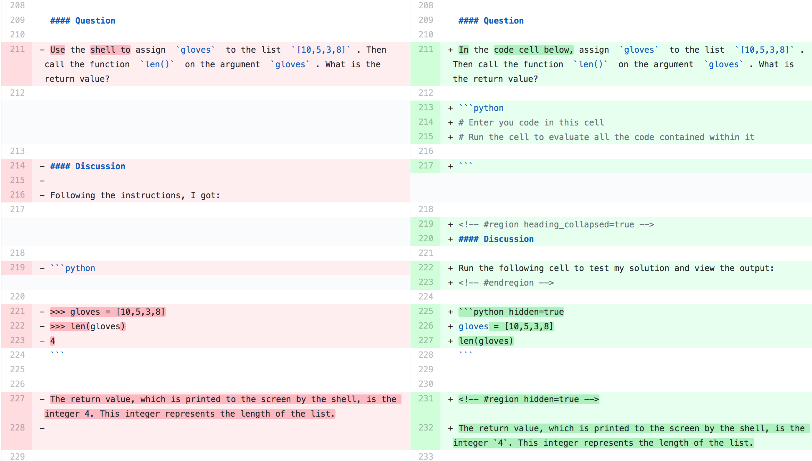
<!-- #endregion -->

<!-- #region slideshow={"slide_type": "slide"} -->
# Where Next?

- OpenLearn demos *(suggestions?)* — examples at: https://github.com/ouseful-demos/openlearn_md
- module transformations / treatments *(on request)*;
- internal projects??? *(appy to help you pitch one / join in on one...*.
<!-- #endregion -->
